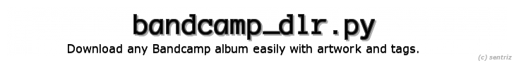

bandcamp_dlr is a python **3+** script for downloading, renaming, and tagging albums from [Bandcamp](http://bandcamp.com/).

You must supply the script and artist, and an album name. These must be exactly how you see them in the album url.

http://**artist**.bandcamp.com/album/**album-name**/

Installation
-----------

    pip install -r requirements.txt
    python bandcamp_dlr.py --help
    

Third party modules
-----

### required ###

* [mutagen](https://pypi.python.org/pypi/mutagen) (mp3 tagging).

* [docopt](https://pypi.python.org/pypi/docopt) (argument parsing).

### included ###

* [wgetter](https://pypi.python.org/pypi/wgetter) (**(c)** *phoemur*) (downloading files).

* jsobj (**(c)** *darkf*) (website parsing)

* [slimit](https://pypi.python.org/pypi/slimit) (**(c)** *rspivak*) (required by jsobj).

* [colorama](https://pypi.python.org/pypi/colorama) (**(c)** *tartley*) (CLI colours).

--

Please note, you can download the required modules in one step with:

    pip install -r requirements.txt

Usage
-----

    bandcamp_dlr.py (<url> | --artist=<name> --album=<name>)
                    [--get-art] [--folder=<name>] [--exclude=<list>]

Options
-----

    -h, --help       Show this screen.
    -v, --version    Show version.
    --get-art        Download album artwork.
    --folder=<name>  Name of download folder [default: downloads].
    --exclude=<list> List of tracks to exclude from download. (seperated by a space)

Examples
-----

    bandcamp_dlr.py http://frank-zappa.bandcamp.com/album/hot-rats/ --get-art
    bandcamp_dlr.py --artist="the-doors" --album="la-woman" --folder="My Music"
    bandcamp_dlr.py --artist="pinkfloyd" --album="dsotm" --exclude="3 5 7"
    
FAQ
-----

* *Download has stopped at x%, help?*

    Send your shell a KeyboardInterrupt. ^C, ^Z, ect.

* *Will this software work on any OS?*

    It has only been tested on a Windows machine (so far), but it has been developed in a way that should make it cross-platform. (but not cross-pyversion)
    
Terms of service/use
-----

By using the script above, you acknowledge and agree to the following terms of service/use:

1.   Do not use this script to download copyrighted audio.
2.   High quality audio is not guaranteed; the script uses audio provided by Bandcamp.

Piracy: I do not condone piracy in any form. My goal that this tool be used to obtain legal audio that would otherwise be extremely difficult to find. Bandcamp is a good source for these audio clips and allows new artists to showcase their work and earn a rightful income from it. 

To ensure the survival of this tool and to help the artists who are providing the music, please buy their singles/albums directly from Bandcamp.

This script is just a simple tool, and I hope you will find it useful.
